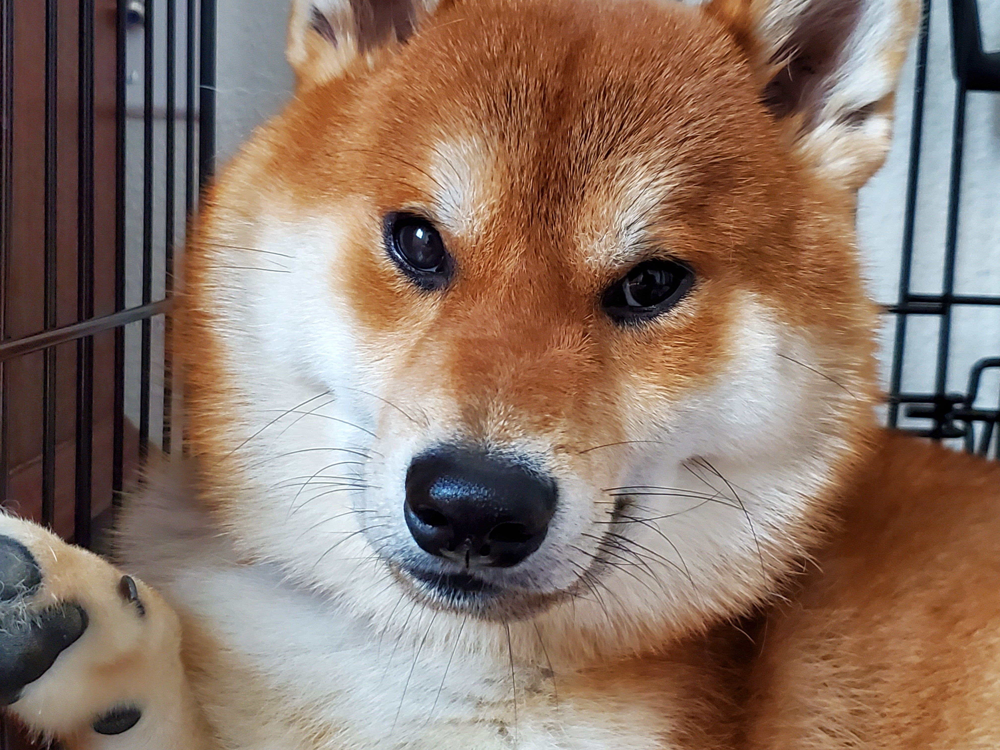

# Welcome to Brandon's User Page

```
cout << "Hello World!" << endl;
InsertTheTwinkie();
```



## Who am I?

**Hello! 😃 My name is Brandon Wang, and I am a third year at the University of California San Diego.**

I am pursuing a *Cognitive Science with Spec. in Machine Learning and Neural computations* major with a minor in *Computer Science*.

My favorite quote is from Michael Jordan, 
> Champions do not become champions when they win an event, but in the hours, weeks, and months, and years they spend preparing for it. The victorious performance itself is merely a demonstration of their championship character.


Some fun facts about me
- I have hitchhikers thumb
- Loved playing and building video games
- I can cook only one thing - Korean tofu soup
- I am an INT-P personality type

In order, my favorite programming languages are
1. C#
2. C++
3. Java
4. C
5. Python and Micropython
6. JavaScript
7. Objective C
8. Assembly

[Some other things I like to do](interests.md)

## Programming Experience

I have been a programmer since I was in elementary school, where I would build games using LUA on the [Roblox](https://corp.roblox.com/parents/) platform. Since then, I have loved the idea of creating digital experiences through code and have followed this passion throughout my life. 

Currently, I am working on an IoT project using AVR MCU's, Zigbee RF Chips, and a WPF client on a Windows PC in order to track sensor data, perform automation, and create a user-friendly experience in automation and management. 

My (rough) timeline for this project
- [x] Logistics and Planning, Technology Research, Product Development Timeline
- [X] Create a working prototype
- [ ] Refine prototype and add more functionality 
- [ ] Brand creation
- [ ] Convert all COTS electronics into proprietary customized PCBs and have a pilot board
- [X] Design a chassis with CAD and create a 3D prototype with a 3D printer
- [ ] Convert the chassis design into a plastic injection mold
- [ ] Create a few pilots and launch a pilot test to receieve user feedback and changes
- [ ] Create brand recognition
- [ ] Start mass producing
- [ ] Get $$$
